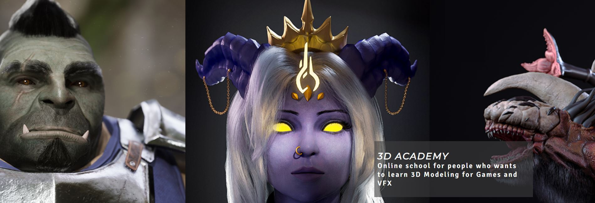
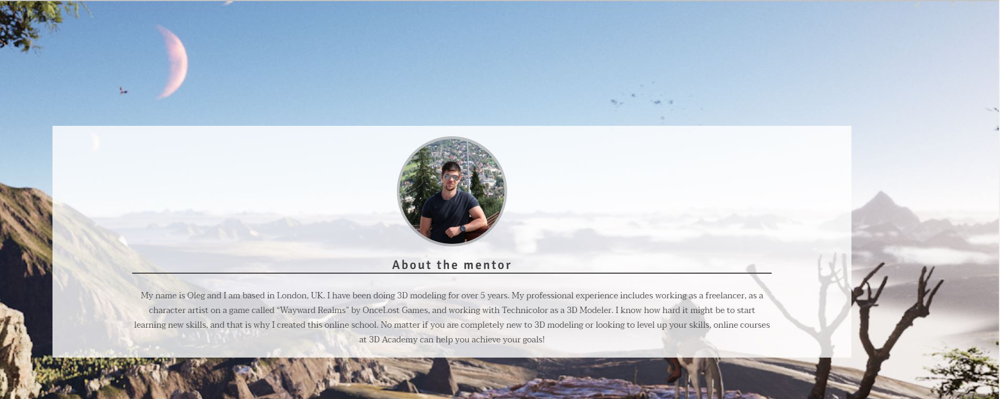

# 3D Academy

3D Academy is an online school for people who want to learn how to create amazing 3D Models for Games or VFX. This website will be useful for people with different levels of 3D modeling knowledge, either people who are completely new, or people who are looking to extend their knowledge. 

This website will provide the information about the school and mentor, who will be running the program, different types of courses this school offers. This website also provides a gallery with mentor's work and a sign-up form for people who want to join the school or get more informattion about the courses.

## Features

This section is describing all the existing features available on the website

* **Navigation bar**

-Navigation bar features the links to different sections of the website, such as Home, About, Courses, Gallery, and Contact Form. It is fully responsive, fixed to the top of the page, and it also contains the logo of "3D Academy". Navigation by navbar offers a smooth scrolling through the website for better user experience.

-This section will allow user to easily navigate through the website without scrolling or need to use "Back" button of the browser.

* **The Hero Image and Intro text**

-The Hero Image includes a collage of mentor's personal work and it overlayed with a short description of the school. Hero Image features Parallax Scrolling.

-This section will introduce the user to the school and will give a first impression about the mentor experience.

* **About Section**

-About section consists of the background image from one of the projects that mentor has worked on previously and it features Parallax Scrolling effect. It overlayed with mentor's profile, which consists of profile image on top, and short bio at the bottom.

-This section will provide users with information about the mentor, his experience and the reason why he created this school. People will feel more confident joining the school if they know who their mentor is and what expereince he's got.

