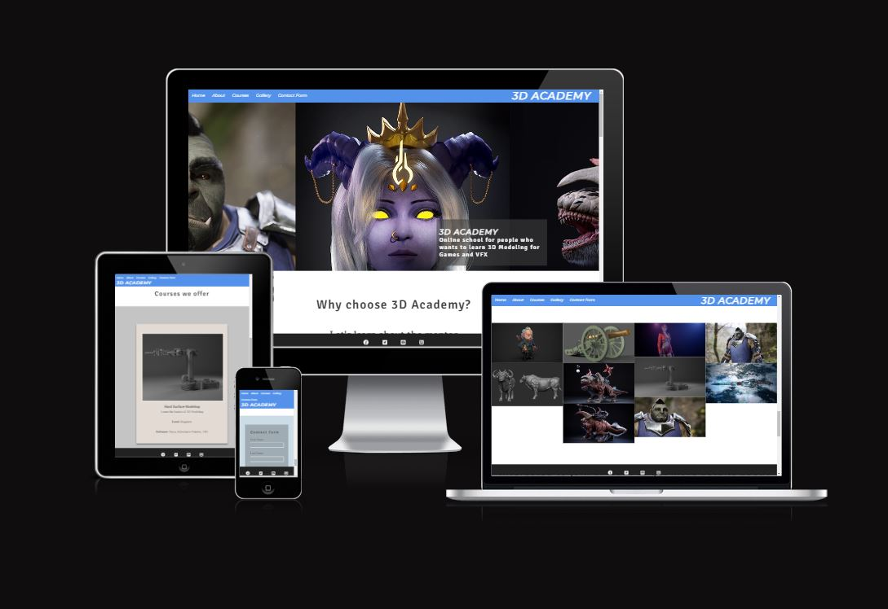

# 3D Academy

3D Academy is an online school for people who want to learn how to create amazing 3D Models for Games or VFX. This website will be useful for people with different levels of 3D modeling knowledge, either people who are completely new, or people who are looking to extend their knowledge. 

This website will provide the information about the school and mentor, who will be running the program, and different types of courses this school offers. This website also provides a gallery with mentor's work and a sign-up form for people who want to join the school or get more informattion about the courses.

## Features

This section is describing all the existing features available on the website

* **Navigation bar**

-Navigation bar features the links to different sections of the website, such as Home, About, Courses, Gallery, and Contact Form. It is fully responsive, fixed to the top of the page, and it also contains the logo of "3D Academy". Navigation by navbar offers a smooth scrolling through the website for better user experience.

-This section will allow user to easily navigate through the website without scrolling or need to use "Back" button of the browser.

* **The Hero Image and Intro text**

-The Hero Image includes a collage of mentor's personal work and it overlayed with a short description of the school. Hero Image features Parallax Scrolling.

-This section will introduce the user to the school and will give a first impression about the mentor experience.

* **About Section**

-About section consists of the background image from one of the projects that mentor has worked on previously and it features Parallax Scrolling effect. It overlayed with mentor's profile, which consists of profile image on top, and short bio at the bottom.

-This section will provide users with information about the mentor, his experience and the reason why he created this school. People will feel more confident joining the school if they know who their mentor is and what expereince he's got.

* **Courses**

-Courses section consists of two Cards with details about the courses. It has the background image on top, showing a 3D model related to the course, and at the bottom description of the course providing the information what course it is, what level of knowledge required and what software students will use. This section is responsive and on the smaller screens cards will allign vertically, on top of each other, instead of being two in the row.

-This section will introduce users to the courses that school is offering, giving them the option of two different courses - one is for begginers who want to learn hard surface modeling, and another course at intermidiate level students teaching how to create a character for a video game.

* **Gallery**

-The gallery contains the 3D artwork from mentor's portolio, showcasing the variety of experience and knowledge. 

-This section is important as having a great portfolio showcase can inspire and persuade users to sign up to the program.

* **Sign-up Form**

-Sign-up is a simple form that allows user to enter their first name, last name, and email address. There are also radio buttons which allow user to select what course they are interested in, either Hard Surface, Character Modeling, or both. All fields are mandatory and user won't be able to submit the form without filling up all the fields and selection one option from the radio buttons.

-This section is important as it allows user to show the interest in joining the school and for the mentor to follow up and provide all the details about the course for the user. 

* **Footer**

-Footer is located at the bottom of the page and it contains the links to social medias, such as Instagram, Facebook, Twitter, and Youtube.

-User can use this section to quickly access social medie profiles related to this school or mentor, learn more, or maybe leave a feedback or chat. Because footer is fixed it will always stay at the bottom part of the screen and user doesn't have to scroll all the way down to access the links.

* **Sign-up Page**

-Once user completes and submits the sign-up form user will be taken to the new webpage with "Thank you" message. This page consists of Navigation bar, Footer, and a message in the middle. The structure is almost identical to the main page, but with only one difference - Navigation Bar got button only to Home section, which will take the user back to the main page.

-It is important as this section will provide the user with confirmation that form has been submitted and mentor will get in touch soon, and Home button on Navigaton bar will allow user to return back to the main page without using the Back button on their browser.

## Testing

In this section I did some of the automated and manual tests in order to ensure that project is functioning correctly.

### Validator Testing

* **HTML**

-After using W3C Validator I have recieved one warning about my HTML code that suggests using headings for "section" elements:

-In this situation, instead of adding headers directly inside the section, I have created separate section inside of my HTML code that contains a header element for each of the section. I found this way to be easier to align the elements and apply different style to them.

